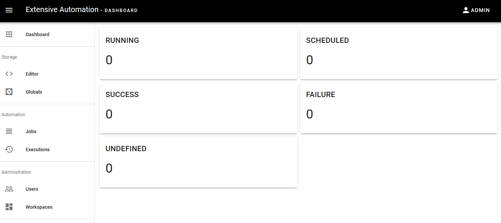

Web interface for ExtensiveAutomation
=====================================

Introduction
------------

The web interface enable to interact with the ExtensiveAutomation throught the REST API.
The purpose of this new interface is to replace the qt application.

Installing from source
----------------------

1. Clone this repository on your linux server

        git clone https://github.com/ExtensiveAutomation/extensiveautomation-webclient.git

2. As precondition, install the `npm` and `nodejs` command then run the following command:

        cd extensiveautomation-webclient/
        npm install 
        

3. Finnaly, start the web interface in development mode

        npm run serve
        
Installing from docker hub
-------------------------

1. Downloading the image

        docker pull extensiveautomation/extensiveautomation-webclient:latest

2. Start the container

        docker run -dit --name extensive-webclient -p 8080:80 extensiveautomation/extensiveautomation-webclient

3. You can now load the web interface from url `http://<ip_server>:8080/`

4. If you can connect the extensive server, you need provide the following parameter in the login page:

        Api URL = http://<ip_server_extensive>:8081
        Api Path = /
        Api Login = admin
        Api Password = password
        
Build from code source
----------------

1. Execute the following command to build the source

        npm run build
        
2. The output `dist` can deployed on a web server. A configuration for apache if provided in source  `apache\extensiveautomation_web.conf`.

        Listen 443
        
        <VirtualHost *:443>

          SSLEngine on

          SSLCertificateFile /etc/pki/tls/certs/localhost.crt
          SSLCertificateKeyFile /etc/pki/tls/private/localhost.key

          LogLevel warn
          ErrorLog  /var/log/extensiveautomation_web_error_ssl_rp.log
          CustomLog /var/log/extensiveautomation_web_access_ssl_rp.log combined

          DocumentRoot /var/www/extensiveautomation
          
          <Directory "/var/www/extensiveautomation">
            <IfModule mod_rewrite.c>
              RewriteEngine On
              RewriteBase /
              RewriteRule ^index\.html$ - [L]
              RewriteCond %{REQUEST_FILENAME} !-f
              RewriteCond %{REQUEST_FILENAME} !-d
              RewriteRule . /index.html [L]
            </IfModule>
           </Directory>

        </VirtualHost>

    The web interface is running on tcp port 443 with tls mode.

    
Build docker image
--------------------------

1. Prepare a production version with `npm` command

        npm run build
      
2. Build the docker image with the following command.

        docker build -t extensiveautomation-webclient .
   
   
Author
-------

It was created by *Denis MACHARD*
 